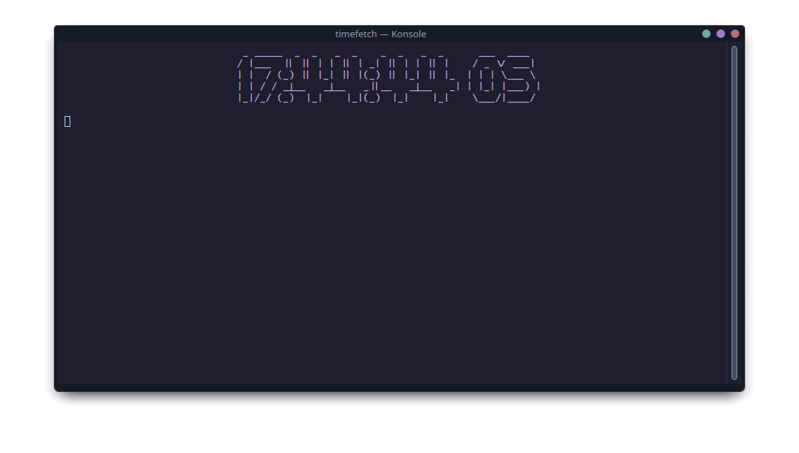

# 

Timefetch is a command-line customizable time utility written in Bash. It provides a visually appealing way to display the current time along with various customizable options.

The primary purpose of Timefetch is to offer a stylish representation of the current time in terminal environments. It aims to enhance the visual experience of viewing the time on the command line.

You can configure Timefetch to your liking by adjusting various settings such as whether to display minutes and seconds, using the 24-hour time format, choosing text color, and setting text alignment. These configurations are stored in a simple configuration file located at `~/.config/timefetchrc`.

If the configuration file doesn't exist, Timefetch will create it with default values, ensuring a smooth setup process.

Timefetch requires Figlet to generate ASCII art for the time display. If Figlet is not installed on your system, you can easily install it using your package manager.

You can further customize Timefetch to display exactly what you want. Through the use of command-line flags and the configuration file, you have the flexibility to change existing information outputs or add your own custom ones.

Currently, Timefetch provides support for almost any environment where Bash is available. Whether you're using Linux, macOS, or another Unix-like system, Timefetch can seamlessly integrate into your terminal workflow.

For more information on dependencies, installation instructions, and additional details, please refer to the [Timefetch GitHub repository](https://github.com/kadircx/timefetch).
